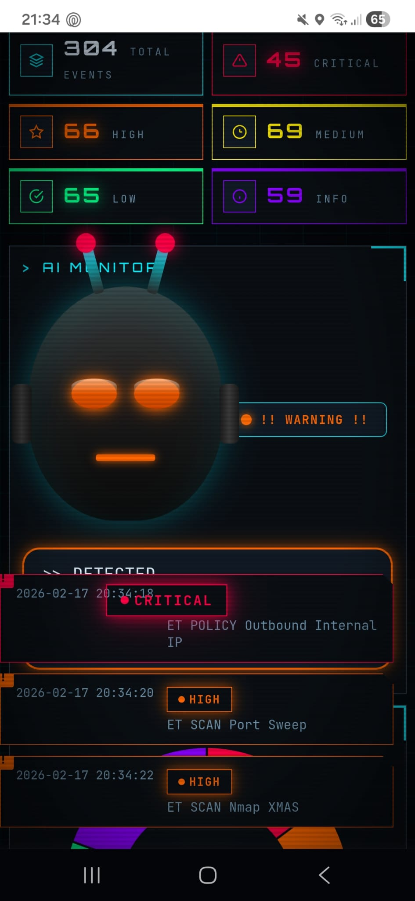
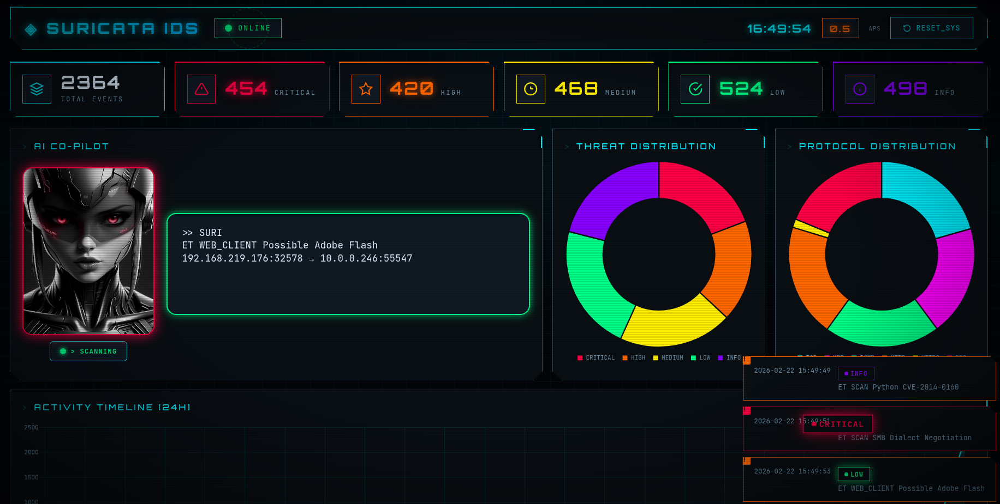

# Suricata Dashboard

A real-time web-based dashboard for monitoring and visualizing Suricata IDS/IPS alerts and metrics.

## Overview

Suricata Dashboard is a lightweight Node.js application that provides real-time visualization of Suricata intrusion detection/prevention system events. It reads EVE JSON logs generated by Suricata and displays comprehensive metrics, charts, and alerts through an intuitive web interface with live WebSocket updates.

## Features

- **Real-time Metrics**: Live updates via WebSocket connections
- **Alert Visualizations**:
  - Alerts by severity level (Critical, High, Medium, Low, Info)
  - Alerts by protocol (TCP, UDP, ICMP, HTTP, DNS, etc.)
  - 24-hour activity timeline
- **Top Statistics**:
  - Most triggered detection signatures
  - Top source IPs
  - Top destination IPs
- **Alert Browser**: Recent alerts table with search functionality
- **Toast Notifications**: Desktop notifications for new critical alerts
- **RESTful API**: Programmatic access to metrics and alerts

## Requirements

- Node.js 18+
- npm or yarn
- Suricata IDS/IPS (optional - includes test data generator)

## Installation

1. Clone the repository:
```bash
git clone https://github.com/Elorri79/suricata-dashboard.git
cd suricata-dashboard
```

2. Install dependencies:
```bash
npm install
```

## Configuration

### Environment Variables (Optional)

You can customize the application behavior using environment variables:

```bash
export SURICATA_LOG=/path/to/eve.json  # Default: logs/eve.json
export PORT=3000                        # Default: 3000
```

## Running the Application

### Start the server:

```bash
npm start
```

The dashboard will be available at: **http://localhost:3000**

### Development mode:

```bash
npm run dev
```

## Log Format

The dashboard processes Suricata EVE JSON logs (eve.json):

```json
{
  "timestamp": "2024-01-15T10:30:45.123456",
  "event_type": "alert",
  "src_ip": "192.168.1.100",
  "src_port": 45678,
  "dest_ip": "10.0.0.50",
  "dest_port": 80,
  "proto": "TCP",
  "alert": {
    "signature_id": 2002919,
    "signature": "ET SCAN Potential SSH Scan OUTBOUND",
    "severity": 2
  }
}
```

### Supported Fields

| Field | Description |
|-------|-------------|
| timestamp | Event date and time |
| event_type | Event type (alert, etc.) |
| src_ip | Source IP address |
| src_port | Source port |
| dest_ip | Destination IP address |
| dest_port | Destination port |
| proto | Protocol (TCP, UDP, ICMP) |
| alert.severity | 1=Critical, 2=High, 3=Medium, 4=Low |
| alert.signature | Detection rule signature |

## REST API

The application exposes a RESTful API for programmatic access:

| Endpoint | Method | Description |
|----------|--------|-------------|
| `/api/metrics` | GET | Get current metrics and statistics |
| `/api/alerts` | GET | Get recent alerts (supports `?limit=50` query parameter) |
| `/api/reset` | POST | Reset all metrics to zero |

### Example API Usage:

```bash
# Get current metrics
curl http://localhost:3000/api/metrics

# Get last 100 alerts
curl http://localhost:3000/api/alerts?limit=100

# Reset metrics
curl -X POST http://localhost:3000/api/reset
```

## Integration with Suricata

To connect the dashboard with a real Suricata installation:

1. Configure Suricata to output EVE JSON logs by editing `suricata.yaml`:

```yaml
- interface: eth0
  # ... other options

outputs:
  - eve-log:
      enabled: yes
      filetype: regular
      filename: eve.json
      types:
        - alert
        - stats
```

2. Set the environment variable to point to your Suricata log file:

```bash
export SURICATA_LOG=/var/log/suricata/eve.json
npm start
```

## Technology Stack

- **Backend**: Node.js, Express.js
- **Real-time Communication**: Socket.IO (WebSocket)
- **Frontend**: Vanilla JavaScript, Chart.js
- **Styling**: Custom CSS with responsive design

## Project Structure

```
suricata-dashboard/
├── server.js              # Main server application
├── public/
│   ├── index.html         # Main dashboard UI
│   ├── css/
│   │   └── style.css      # Dashboard styles
│   └── js/
│       ├── app.js         # Frontend application logic
│       └── chart.min.js   # Chart.js library
├── logs/                  # Default log directory (ignored by git)
├── package.json           # Project dependencies
└── README.md              # This file
```

## Screenshots

### Dashboard Overview


### Alert Details


## Credits

This project was developed using:
- **OpenCode** - AI-powered development assistant
- **MiniMax 2.5** - Language model
- **GLM 5** - Language model
- **Warp** - Agentic Development Environment

## Contributing

Contributions are welcome! Please feel free to submit a Pull Request.

## License

MIT
