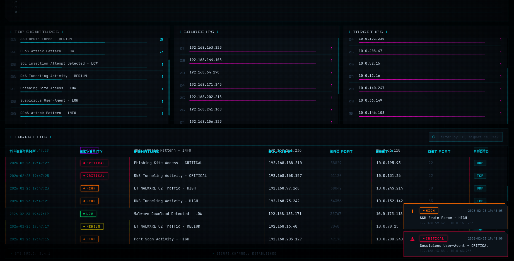

# Suricata Dashboard - AI Monitor Edition v3.0.0

A real-time cyberpunk-styled web dashboard for monitoring and visualizing Suricata IDS/IPS alerts with an interactive AI co-pilot named SURI.


## Overview

Suricata Dashboard is a lightweight Node.js application that provides real-time visualization of Suricata intrusion detection/prevention system events. It features a stunning cyberpunk aesthetic inspired by Metal Hurlant, with a unique AI co-pilot (SURI) that reacts to threats in real-time.

## Features

- **AI Co-Pilot SURI**: Interactive video avatar that reacts to threats with different status messages based on severity level
- **Real-time Metrics**: Live updates via WebSocket connections
- **Alert Visualizations**:
  - Alerts by severity level (Critical, High, Medium, Low, Info)
  - Alerts by protocol (TCP, UDP, ICMP, HTTP, DNS, HTTPS)
  - 24-hour activity timeline
- **Top Statistics**:
  - Most triggered detection signatures
  - Top source IPs (attackers)
  - Top destination IPs (targets)
- **Threat Level Bar**: Dynamic threat level indicator (LOW → CRITICAL)
- **Threat Radar**: Animated radar display showing activity
- **Attack Origin Map**: Interactive world map showing attack sources with geographic location
- **Alert Browser**: Advanced table with filtering and search
- **Export Data**: Export alerts to CSV or JSON format
- **Toast Notifications**: Desktop notifications for new critical alerts
- **Audio Alerts**: Sound notifications for critical and high severity alerts
- **PWA Support**: Installable as a standalone web app
- **RESTful API**: Programmatic access to metrics and alerts
- **Responsive Design**: Adapts to any screen size

### Visual Effects (v3.0.0)

- **Radar Animation**: Rotating radar scanner in corner
- **Glitch Effect**: Cyberpunk glitch on title
- **Matrix Rain**: Subtle binary code falling in background
- **Threat Level Bar**: Real-time threat meter
- **CRT Enhancement**: Improved retro screen effect
- **Parallax Avatar**: 3D parallax effect on mouse movement
- **Alert Flash**: Dramatic red flash on critical alerts
- **System Pulse**: Heartbeat pulse indicator

### New Features (v3.0.0)

- **Attack Origin Map**: Interactive Leaflet map showing geographic location of attack sources
- **Advanced Filtering**: Filter alerts by severity, protocol, source/destination IP, and date range
- **Data Export**: Export filtered alerts to CSV or JSON files
- **Audio Alerts**: Sound notifications for critical and high severity threats
- **PWA Installation**: Install as standalone app on desktop and mobile
- **Sound Toggle**: Mute/unmute audio alerts
- **Fullscreen Mode**: Toggle fullscreen display

## Quick Start

```bash
# Clone and install
git clone https://github.com/Elorri79/suricata-dashboard.git
cd suricata-dashboard
npm install

# Run
npm start
```

Then open **http://localhost:3000** in your browser.

## Requirements

- Node.js 18+
- npm or yarn
- Suricata IDS/IPS (optional - includes test data generator)

## Configuration

### Environment Variables (Optional)

```bash
export SURICATA_LOG=/path/to/eve.json  # Default: logs/eve.json
export PORT=3000                        # Default: 3000
```

## Running the Application

### Start the server:

```bash
npm start
```

The dashboard will be available at: **http://localhost:3000**

The application includes a built-in test data generator that creates realistic alert data, so you can see the dashboard in action immediately without configuring Suricata.

### Test Endpoints:

```bash
# Start injecting random alerts every 2 seconds
curl http://localhost:3000/api/test/start

# Stop test injection
curl http://localhost:3000/api/test/stop

# Inject a specific severity alert
curl http://localhost:3000/api/test/critical
curl http://localhost:3000/api/test/high
curl http://localhost:3000/api/test/medium

# Reset all metrics
curl -X POST http://localhost:3000/api/reset
```

## What's New - SURI AI Monitor

The latest version features **SURI**, an interactive AI co-pilot:

- **Video Avatar**: A cyborg character that serves as your AI monitor
- **Real-time Reactions**: SURI changes status based on detected threats
- **Speech Bubble**: Shows the latest threat signature and source/destination IPs
- **Parallax Effect**: 3D tilt effect on mouse movement
- **Alert History**: Displays attack patterns and threat intelligence

### SURI Status Messages:

| Status | Meaning |
|--------|---------|
| ⚠ CRITICAL THREAT DETECTED | Critical severity alert |
| ! HIGH SEVERITY ALERT | High severity alert |
| > ANALYZING ANOMALY | Medium severity alert |
| > SCANNING ACTIVITY | Low severity alert |
| > MONITORING NETWORK | Info severity / Normal |
| SURI ONLINE | System operational |

## REST API

The application exposes a RESTful API:

| Endpoint | Method | Description |
|----------|--------|-------------|
| `/api/metrics` | GET | Get current metrics and statistics |
| `/api/alerts` | GET | Get recent alerts (supports `?limit=50&severity=critical&protocol=TCP`) |
| `/api/test/start` | GET | Start test alert injection |
| `/api/test/stop` | GET | Stop test alert injection |
| `/api/test/:severity` | GET | Inject specific severity alert |
| `/api/reset` | POST | Reset all metrics to zero |

### Filter Parameters for `/api/alerts`

| Parameter | Example | Description |
|-----------|---------|-------------|
| `limit` | `?limit=100` | Number of alerts to return |
| `severity` | `?severity=critical` | Filter by severity |
| `protocol` | `?protocol=TCP` | Filter by protocol |
| `source_ip` | `?source_ip=192.168.1.1` | Filter by source IP |
| `dest_ip` | `?dest_ip=10.0.0.1` | Filter by destination IP |
| `from` | `?from=2024-01-01T00:00:00` | Filter alerts from date |
| `to` | `?to=2024-01-02T00:00:00` | Filter alerts to date |

## Integration with Suricata

To connect with a real Suricata installation:

1. Configure Suricata to output EVE JSON logs in `suricata.yaml`:

```yaml
outputs:
  - eve-log:
      enabled: yes
      filename: eve.json
      types:
        - alert
```

2. Set the environment variable:

```bash
export SURICATA_LOG=/var/log/suricata/eve.json
npm start
```

## Technology Stack

- **Backend**: Node.js, Express.js
- **Real-time**: Socket.IO (WebSocket)
- **Frontend**: Vanilla JavaScript, Chart.js
- **Styling**: Custom CSS (Cyberpunk/Metal Hurlant aesthetic)

## Project Structure

```
suricata-dashboard/
├── server.js              # Main server application
├── public/
│   ├── index.html        # Main dashboard UI
│   ├── manifest.json    # PWA manifest
│   ├── css/
│   │   └── style.css    # Cyberpunk dashboard styles
│   ├── js/
│   │   ├── app.js       # Frontend application logic
│   │   └── chart.min.js # Chart.js library
│   └── videos/
│       ├── ok.mp4       # SURI idle/ok video
│       ├── medium.mp4   # SURI medium alert video
│       └── critical.mp4 # SURI critical alert video
├── logs/                # Default log directory
├── data/                # Alert data storage
├── package.json
└── README.md
```

## Screenshots

### Dashboard Overview


### Alert Details & SURI Reactions


### Threat Analysis


## Credits

This project was developed using:
- **OpenCode** - AI-powered development assistant
- **SURI Avatar** - Custom video content

## License

MIT
